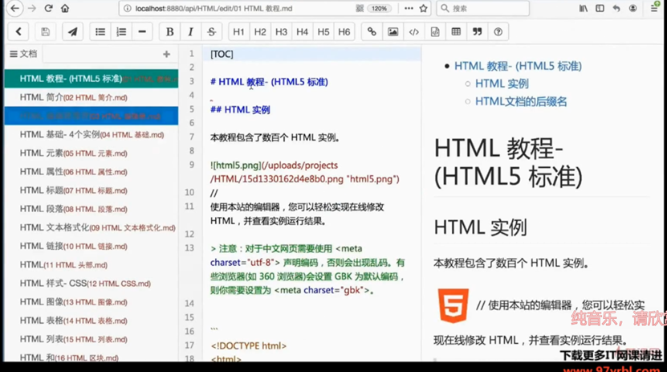

## Go读书社区

运行环境：
Go 1.20.3

beego v2.1.0

ElasticSearch 7.17.4

### v0.0 用户模块
cookie-session机制
#### v0.0.1 实现登录功能
- 采取cookie-session机制判断用户登录状态，如果能在浏览器中拿到cookie则与数据库中的session进行验证
- 否则cookie可能失效，自动跳转到登录界面，通过传统的输入用户名和密码的方式进行登录，再重新设置用户的cookie-session信息
#### v0.0.2 实现注册功能
- 渲染注册页面，将用户POST的注册信息进行一系列格式验证，并对用户的密码进行加密，保存到数据库中。


### v0.1 读书模块
根据Json请求，判断当前书籍是否为私有书籍，若为公开书籍则可以查询图书详情页
#### v0.1.1 实现图书详情页(目录首页)
- 查询图书的详情
- 根据图书ID获得章节目录(GetMenu)

图书详情页(目录首页)


图书详情


目录


#### v0.1.2 实现图书目录详情页
- 获取其他用户对该书的评论内容，包括**评分、用户昵称、评论内容、头像、评论时间(BookComments)**
评论评分


### v0.2 图书编辑模块和用户图书管理模块
#### v0.2.1 实现图书编辑模块和用户图书管理模块的所有功能
包括编辑页(edit),内容和保存(content),上传图书照片(upload),添加/删除章节(create/delete)


#### v0.2.2 修补了一些bug 


### v0.3 慢查询优化，基于读写复制的分库分表，ES搜索优化以及添加了页面静态化，修复了一些bug
- 慢查询优化包括：
    - 索引优化(独立索引：主键优化；组合索引)
    - 对复杂语句查询的优化(单个复杂查询查分成多个简单查询)
    - 数据库并发优化
        - 单库优化(数据库连接池),已经由beego中的orm实现
        - 多库优化(分表、主从读写分离(水平分库)、分库(垂直分库))
            - 分表
            将大量数据的表拆分成多个
            - 主从读写分离
            借助bin log和relay log
            - 垂直分库
              基于业务逻辑层面，可以找一些相对独立的数据单独建立数据库
              例如在本项目中的粉丝、收藏、评论、评分
              尽量不要耦合的数据：例如图书详情和分类
- ES搜索


- 页面静态化
  - 主页静态化
    某些页面例如主页，若没有立即更新，不太会影响用户的体验。
    因此可以将主要的html存储在缓存文件中，这样就省去了去数据库中查询的性能消耗
  - 伪静态化
  将某些路径修改成仿佛是静态文件的url
  实际的底层数据还是要来动态获取
  - 过期缓存文件的清理
  某些页面如果长期不用，则造成缓存文件的堆积，因此程序中要找到这些过期缓存文件并进行清理
  这里需要建立定时任务，定期清理缓存文件，可以借助beego的toolbox来实现


### v1.0 添加了Redis做动态缓存，修复了一些bug
若整个页面有一部分数据可以做静态化处理，可以使用动态缓存
- 图书详情页中的**章节目录，评论列表**
    用户对于该书的评论以及章节目录的更新可以稍微不及时
- 社交页面
    **分享、收藏、关注、粉丝**
    页面结构对于不同用户是一样的，但以上模块是不一样的
    因此可以为**不同用户各缓存一份数据**(针对不同用户，在redis中的key不同),设置好淘汰机制(例如对常访问网站的用户的数据放在缓存中)


### v2.0 解决了nginx多机部署Session的同步问题


注：ElasticSearch版本后期还需进行适配


### 项目结构

```
$ tree -L 2
├── cache
│   └── staticpage
├── conf
│   ├── app.conf
│   ├── dynamicache.conf
│   └── pagecache.conf
├── mbook
├── mbook.exe
├── mbook.sql
├── mbook.tar.gz
├── mbook_useraction.sql
├── README.md
├── static
│   ├── api
│   ├── bootstrap
│   ├── cropper
│   ├── css
│   ├── editor.md
│   ├── font-awesome
│   ├── fonts
│   ├── highlight
│   ├── html5shiv
│   ├── images
│   ├── jquery
│   ├── js
│   ├── jstree
│   ├── katex
│   ├── layer
│   ├── mergely
│   ├── nprogress
│   ├── openstatic
│   ├── prettify
│   ├── respond.js
│   ├── to-markdown
│   ├── vuejs
│   ├── wangEditor
│   └── webuploader
├── uploads
│   └── 151091010
└── views
├── account
├── book
├── document
├── explore
├── home
├── index.tpl
├── manager
├── search
├── setting
├── template.html
├── user
└── widgets
```

### 编译运行
- 命令行到代码目录下
```
cd $GOPATH/src/mbook
```
- 运行服务
```
bee run
```

默认管理员用户名:`admin` , 密码:`123456`  